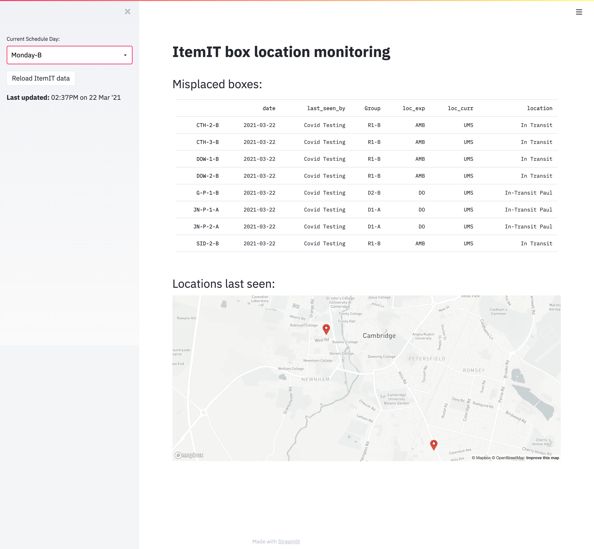

# Cyclical delivery location tracking

Used to track the location of Covid test kits for the a UK University's Covid Student Testing Programme.

## Functionality overview

By making use of the ItemIT API and provided courier schedules, the last known location of ~200 boxes is compared to their scheduled location. A Streamlit app then displays a list and map of all boxes whose last known location does not match their scheduled location. This allows for rapid, pro-active identification of missed collections/deliveries—allowing the operations team to ensure all tests get delivered both to students and the lab.

## Screenshot

